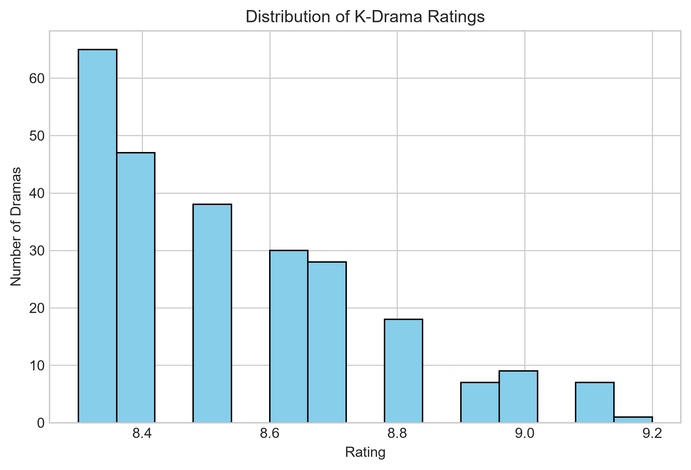
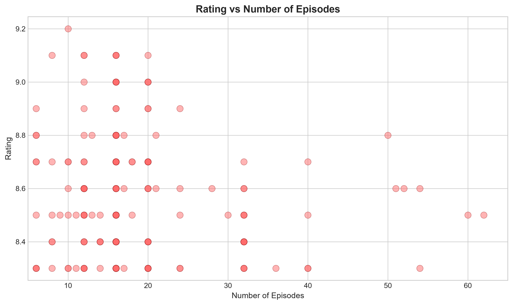
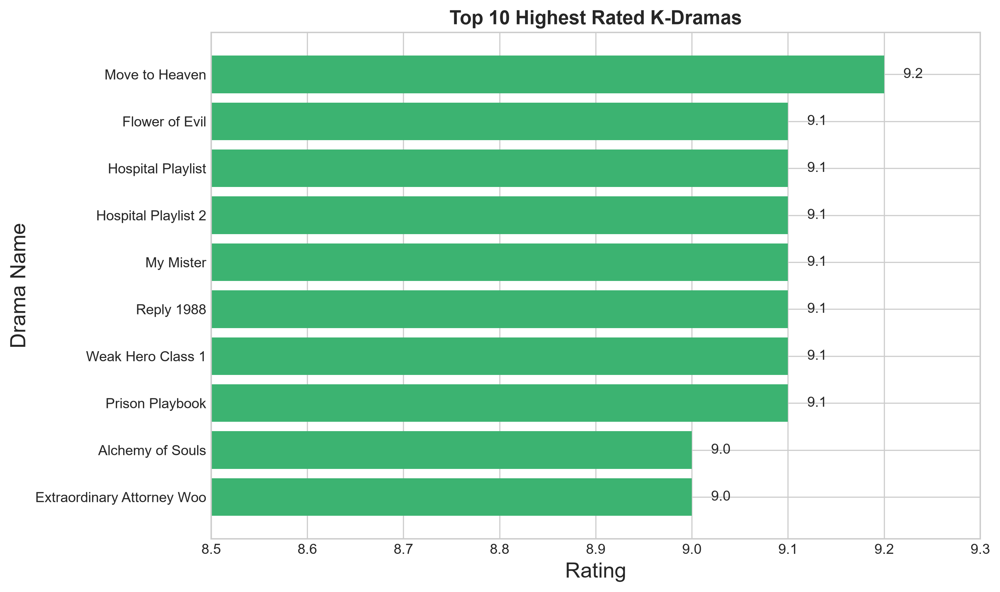

# K-Drama Data Analysis

Exploratory data analysis on the **Top 250 Korean Dramas** dataset — covering data cleaning, database integration, statistical analysis, and visualization using Python.

## 📊 Project Overview

This project performs a complete data science workflow on a real-world Kaggle dataset of the top 250 highest-rated Korean dramas. The goal was to clean messy real-world data, store it in a relational database, and extract meaningful insights through statistics and visualizations.

## 🗂️ Dataset

- **Source:** [Top 250 Korean Dramas (KDrama) Dataset](https://www.kaggle.com/datasets/ahbab911/top-250-korean-dramas-kdrama-dataset) — Kaggle
- **Size:** 250 rows, 17 original columns
- Contains information such as drama name, air dates, rating, genre, cast, director, and more

## 🛠️ Tools & Technologies

- **Python** — Pandas, NumPy, Matplotlib
- **MySQL** — Data storage via SQLAlchemy
- **python-dotenv** — Secure credential management

## 🔧 What Was Done

1. **Data Cleaning**
   - Fixed encoding issues in the raw CSV file
   - Handled missing values in Director, Screenwriter, Content Rating, and Production Companies columns
   - Converted `Rank` column from text ("#1") to integer
   - Converted `Duration` column from text ("1 hr. 10 min.") into total minutes

2. **Database Integration**
   - Loaded cleaned data into MySQL using SQLAlchemy
   - Verified data integrity by reading it back and checking for nulls/duplicates

3. **Statistical Analysis (NumPy)**
   - Calculated mean, median, standard deviation, min, and max for Rating, Duration, and Number of Episodes
   - Computed correlation between Rating and Episodes, and Rating and Duration

4. **Visualization (Matplotlib)**
   - Rating distribution histogram
   - Rating vs. Number of Episodes scatter plot
   - Top 10 highest-rated dramas bar chart

## 📈 Visualizations

### Rating Distribution

### Rating vs Number of Episodes

### Top 10 Highest Rated K-Dramas

## 💡 Key Insights

- Most top-rated dramas fall between an **8.3 to 9.2 rating range**, reflecting the "top 250" nature of the dataset
- **Short-to-medium length dramas (10–20 episodes)** tend to have higher ratings compared to longer dramas (50+ episodes)
- There is a **weak correlation** between number of episodes and rating, suggesting episode count alone doesn't strongly predict quality

## 📁 Files

- `kdrama_data_analysis.ipynb` — Main Jupyter Notebook with full analysis
- `kdrama_data.csv` — Raw dataset (before cleaning)
- `Kdramas_final_clean.csv` — Cleaned dataset used for analysis
- `rating_distribution.png`, `rating_vs_episodes.png`, `top10_dramas.png` — Saved visualizations

## ⚙️ How to Run

1. Clone this repository
2. Install dependencies:
